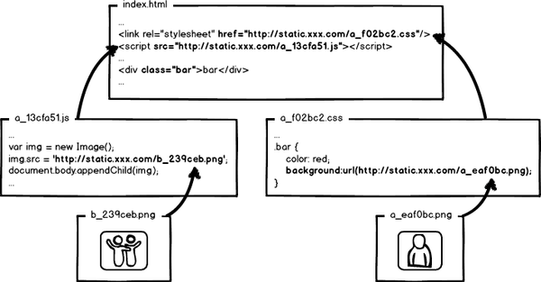

 原文地址：[查看知乎](http://www.zhihu.com/question/20790576)
 
 大公司里怎样开发和部署前端代码？主要有以下问题：

    开发时的和部署时类库的引用和存放是一致还是不同？
    模块放在项目中还是放在 CDN 之类服务器？
    渲染网页用 Nginx 还是其他动态语言的 Web 服务器？
    制作网页的流程，是先有设计师的稿，还是先看模块？
    会选择用自己写的模块还是从社区寻找模块？

没人邀请，看到这个问题不错，路过怒答。（多图预警）
张云龙 [Github 博客](https://github.com/fouber/blog)
前百度工程师，曾负责百度 前端集成解决方案 的核心设计与开发工作。我现在称这个领域为【前端工程】。没错，这是我最爱唠叨的问题域。

这是一个非常有趣的 非主流前端领域，这个领域要探索的是如何用工程手段解决前端开发和部署优化的综合问题，入行到现在一直在学习和实践中。

在我的印象中，facebook是这个领域的鼻祖，有兴趣、有梯子的同学可以去看看facebook的页面源代码，体会一下什么叫工程化。

接下来，我想从原理展开讲述，多图，较长，希望能有耐心看完。

---------------------------- 我是一条分割线 ----------------------------

让我们返璞归真，从原始的前端开发讲起。上图是一个“可爱”的index.html页面和它的样式文件a.css，用文本编辑器写代码，无需编译，本地预览，确认OK，丢到服务器，等待用户访问。前端就是这么简单，好好玩啊，门槛好低啊，分分钟学会有木有！

然后我们访问页面，看到效果，再查看一下网络请求，200！不错，太™完美了！那么，研发完成。。。。了么？

等等，这还没完呢！对于大公司来说，那些变态的访问量和性能指标，将会让前端一点也不“好玩”。

看看那个a.css的请求吧，如果每次用户访问页面都要加载，是不是很影响性能，很浪费带宽啊，我们希望最好这样：

利用304，让浏览器使用本地缓存。但，这样也就够了吗？不成！304叫协商缓存，这玩意还是要和服务器通信一次，我们的优化级别是变态级，所以必须彻底灭掉这个请求，变成这样：

强制浏览器使用本地缓存（cache-control/expires），不要和服务器通信。好了，请求方面的优化已经达到变态级别，那问题来了：你都不让浏览器发资源请求了，这缓存咋更新？

很好，相信有人想到了办法：通过更新页面中引用的资源路径，让浏览器主动放弃缓存，加载新资源。好像这样：

下次上线，把链接地址改成新的版本，就更新资源了不是。OK，问题解决了么？！当然没有！大公司的变态又来了，思考这种情况：

页面引用了3个css，而某次上线只改了其中的a.css，如果所有链接都更新版本，就会导致b.css，c.css的缓存也失效，那岂不是又有浪费了？！

重新开启变态模式，我们不难发现，要解决这种问题，必须让url的修改与文件内容关联，也就是说，只有文件内容变化，才会导致相应url的变更，从而实现文件级别的精确缓存控制。

什么东西与文件内容相关呢？我们会很自然的联想到利用 数据摘要要算法 对文件求摘要信息，摘要信息与文件内容一一对应，就有了一种可以精确到单个文件粒度的缓存控制依据了。好了，我们把url改成带摘要信息的：

这回再有文件修改，就只更新那个文件对应的url了，想到这里貌似很完美了。你觉得这就够了么？大公司告诉你：图样图森破！

唉~~~~，让我喘口气

现代互联网企业，为了进一步提升网站性能，会把静态资源和动态网页分集群部署，静态资源会被部署到CDN节点上，网页中引用的资源也会变成对应的部署路径：

好了，当我要更新静态资源的时候，同时也会更新html中的引用吧，就好像这样：

这次发布，同时改了页面结构和样式，也更新了静态资源对应的url地址，现在要发布代码上线，亲爱的前端研发同学，你来告诉我，咱们是先上线页面，还是先上线静态资源？

    先部署页面，再部署资源：在二者部署的时间间隔内，如果有用户访问页面，就会在新的页面结构中加载旧的资源，并且把这个旧版本的资源当做新版本缓存起来，其结果就是：用户访问到了一个样式错乱的页面，除非手动刷新，否则在资源缓存过期之前，页面会一直执行错误。
    先部署资源，再部署页面：在部署时间间隔之内，有旧版本资源本地缓存的用户访问网站，由于请求的页面是旧版本的，资源引用没有改变，浏览器将直接使用本地缓存，这种情况下页面展现正常；但没有本地缓存或者缓存过期的用户访问网站，就会出现旧版本页面加载新版本资源的情况，导致页面执行错误，但当页面完成部署，这部分用户再次访问页面又会恢复正常了。

好的，上面一坨分析想说的就是：先部署谁都不成！都会导致部署过程中发生页面错乱的问题。所以，访问量不大的项目，可以让研发同学苦逼一把，等到半夜偷偷上线，先上静态资源，再部署页面，看起来问题少一些。

但是，大公司超变态，没有这样的“绝对低峰期”，只有“相对低峰期”。So，为了稳定的服务，还得继续追求极致啊！

这个奇葩问题，起源于资源的 覆盖式发布，用 待发布资源 覆盖 已发布资源，就有这种问题。解决它也好办，就是实现 非覆盖式发布。

看上图，用文件的摘要信息来对资源文件进行重命名，把摘要信息放到资源文件发布路径中，这样，内容有修改的资源就变成了一个新的文件发布到线上，不会覆盖已有的资源文件。上线过程中，先全量部署静态资源，再灰度部署页面，整个问题就比较完美的解决了。

所以，大公司的静态资源优化方案，基本上要实现这么几个东西：

        配置超长时间的本地缓存 —— 节省带宽，提高性能
        采用内容摘要作为缓存更新依据 —— 精确的缓存控制
        静态资源CDN部署 —— 优化网络请求
        更资源发布路径实现非覆盖式发布 —— 平滑升级

全套做下来，就是相对比较完整的静态资源缓存控制方案了，而且，还要注意的是，静态资源的缓存控制要求在前端所有静态资源加载的位置都要做这样的处理。是的，所有！什么js、css自不必说，还要包括js、css文件中引用的资源路径，由于涉及到摘要信息，引用资源的摘要信息也会引起引用文件本身的内容改变，从而形成级联的摘要变化，大概示意图就是：

好了，目前我们快速的学习了一下前端工程中关于静态资源缓存要面临的优化和部署问题，新的问题又来了：这™让工程师怎么写码啊！！！

要解释优化与工程的结合处理思路，又会扯出一堆有关模块化开发、资源加载、请求合并、前端框架等等的工程问题，以上只是开了个头，解决方案才是精髓，但要说的太多太多，有空再慢慢展开吧。或者大家可以去我的blog看其中的一些拆解：fouber/blog · GitHub

    总之，前端性能优化绝逼是一个工程问题！

以上不是我YY的，可以观察 百度 或者 facebook 的页面以及静态资源源代码，查看它们的资源引用路径处理，以及网络请中静态资源的缓存控制部分。再次赞叹facebook的前端工程建设水平，跪舔了。

建议前端工程师多多关注前端工程领域，也许有人会觉得自己的产品很小，不用这么变态，但很有可能说不定某天你就需要做出这样的改变了。而且，如果我们能把事情做得更极致，为什么不去做呢？

另外，也不要觉得这些是运维或者后端工程师要解决的问题。如果由其他角色来解决，大家总是把自己不关心的问题丢给别人，那么前端工程师的开发过程将受到极大的限制，这种情况甚至在某些大公司都不少见！

妈妈，我再也不玩前端了。。。。5555

========================[ 10.29更新 ]========================
这里更新一下：

在评论中， @陈钢@fleuria @林翔 提到了rails，刚刚去看了一下，确实是完成了以上所说的优化细节，对整个静态资源的管理上的思考于本答案描述的一致。很遗憾我直到今天（2014-10-29）才了解到rails中的assets pipeline。这里向以上3位同学道歉，原谅我的无知。

不过整篇回答没有讲解到具体的解决方案实现思路，只是介绍了前端在工程化方向的思考，答案本身是可用的，了解rails的人也可以把此答案当做是对rails中assets pipeline设计原理的分析。

rails通过把静态资源变成erb模板文件，然后加入<%= asset_path 'image.png' %>，上线前预编译完成处理，不得不承认，fis的实现思路跟这个几乎完全一样，但我们当初确实不知道有rails的这套方案存在。

相关资料：英文版：[The Asset Pipeline](http://guides.rubyonrails.org/asset_pipeline.html)，中文版：[Asset Pipeline](http://guides.ruby-china.org/asset_pipeline.html)

========================[ 10.31更新 ]========================
用 F.I.S 包装了一个小工具，完整实现整个回答所说的最佳部署方案，并提供了源码对照，可以感受一下项目源码和部署代码的对照。
源码项目：fouber/static-resource-digest-project · GitHub
部署项目：fouber/static-resource-digest-project-release · GitHub
部署项目可以理解为线上发布后的结果，可以在部署项目里查看所有资源引用的md5化处理。

这个示例也可以用于和assets pipeline做比较。fis没有assets的目录规范约束，而且可以以独立工具的方式组合各种前端开发语言（coffee、less、sass/scss、stylus、markdown、jade、ejs、handlebars等等你能想到的），并与其他后端开发语言结合。

assets pipeline的设计思想值得独立成工具用于前端工程，fis就当做这样的一个选择吧。
编辑于 2014-10-31 169 条评论
知乎用户，上知乎，求欢乐
肖云翔、晓晓、柳辉 等人赞同
每一家大公司都不一样，你只能寻找适合自己的流程。

一般来说，大公司面临的问题就是复杂度。这就如同说，简单的问题，你用汇编写也肯定写得出来，但更复杂的问题就需要用高级语言来抽象，否则其复杂度无法管理。此外，编译不仅仅是能执行就可以，还要考虑目标平台的执行效率。

对于大公司来说，用 CDN 是必然的，只是如何尽可能多地把静态资源放到 CDN 上去。对于图片这种数量有限的资源，一般新增多少都会放到 CDN 而不在乎成本。至于 JavaScript 这类打包方案有无穷组合的资源，则需要特别的优化了。最笨的办法，当然是人手划定几个基本的打包方案，然后在 CDN 上部署。如果组合数有限，把所有打包方案都缓存到 CDN 也是可以的（没有人请求的打包方案就不生成了）。更先进的办法是，统计实际请求的打包方案，然后自动生成优化的打包方案，并且缓存在 CDN 上。

考虑到各家大公司采用的语言不一样，用什么服务器也是不确定的。甚至在一家公司内不同语言的系统用的服务器就不一样。同理，不同团队的合作方式不一样，导致了设计到实现的流程也不一样。就算在同一家公司内，也有可能同时存在最保守的团队和最敏捷的团队，一边必须设计定稿了才开始写第一行代码，另一边想到什么写什么觉得不好看再找设计师调整。

大公司一般都不会非常多的依赖于开源项目，而是自己做自己的项目然后开源。一方面这是 Not Invented Here 的问题；另一方面，确实通用的开源项目无法满足某一家公司非常特定的某些需求，所以就算 idea 是很好的，大公司也会把 idea 搬过来再结合自己的需求做一个自己的版本。
发布于 2013-02-21 2 条评论
苏洋，我有一只八岁的博客 http://www.soulteary.com
John、Linkyhu、张义军 等人赞同
挖个大坑，接下来慢慢填（估计数月）

首先，做项目中，我们可能会遇到的问题可能会有：

问题

    做新的项目的时候，整套工程方案是什么，除了数据和业务层的实现外，前端（服务端+客户端）的工程方案选择什么
        移动端业务的时候，选择什么
            单页应用
            多页应用
            特殊的活动页
        传统PC业务的时候，选择什么
            单页应用
            多页应用
            特殊的活动页
        降级方案如何促成
            依赖开关进行的功能降级（包括兼容）
            纯粹根据接口降级
    做项目时候，对应的协作规范和工具链如何尽可能趋同（约束）
        书写风格？提交格式化？
        代码质量？review？提交lint？test？
            具体到测试中，该用什么框架，BDD如何,TDD又该如何，跨浏览器UI如何做自动测试
        三方依赖的资源管理？字体/图片/媒体/甚至模板 ？HTTPS support?
        配套CDN的支持
        三方依赖的数据接口？mock？dev env?
    已经做完的项目中的内容的复用（如何做一个靠谱的模块仓库）
        优秀的后端模块/功能
        优秀的前端模块/功能
        数据接口包裹复用？
    打包发布，出错回滚，仿真环境模拟和追错
        python/php/nodejs如何发布管理
        纯前端资源如何发布管理
    维护/集成新组件
        上线后如何做监控
        遇到问题如何报警

解决方案

一千个人心中有一千万个苍老师，场景不同，诉求不同，解决方案也不同。

个人认为解决问题的关键除了积累之外，关键在于：模块化仓库、固化简单方案场景（同构化）并配套脚手架方案。

挖坑完毕，待填
发布于 2015-05-04 5 条评论
小芋头君，前端乱炖（www.html-js.com) 最专业的原…
柳辉、知乎用户、昆虫 等人赞同
最后有招聘，有意者留意一下，谢谢~~

虽然我们不是大公司，但是我也来占个位，东西太多慢慢写。

1.开发环境的被动式资源服务。

我们的开发环境是一个叫做ads的服务，在github上找得到，没说开源，但是都是public的项目。
这个环境跑在每个人的机器和测试环境的机器和线上的机器上。
支撑了大搜车所有环境的静态服务。
其实它做的工作比较简单，无非是一个静态文件服务器+一些实时处理。
原理也比较简单，被动式处理，当你访问一个文件的时候，就会去寻找这个文件的需要经过的处理中间件，让文件以管道的形式通过这些中间件，最后返回一个处理过的文件内容。
例如jade和less，我们项目里没有编译和打包的概念，你就写就行了，然后任何环境里访问index.css其实都返回的是index.less的编译结果，打包的过程和配置，都不需要关心。包括jade，less，js压缩，requrejs打包合并都是用这样的方式开发，你写的是这样，你看到的是另一样，简单粗暴，每个人只需要关心自己需要关心的事情，而不是项目的配置和打包之类的事情。

这个环境也无需配置，直接github clone下来，node app.js跑一下就再也不用管了。

2.如何开发和测试？

测试环境。通过切换host，我们有一个测试的域名，叫做f2e.souche.com。默认这个域名是指向一台前端单独的测试服务器的，通过nginx，转发到一个ads的服务上。然后这个服务的背后是我们的前端资源文件，这个项目里还跑了一个定时脚本，一分钟pull一次从github更新代码。
所以f2e.souche.com直接访问，访问的就是测试环境，这个环境的代码永远是最新的，它会定时从github拉取最新的代码。
这个环境主要用来支撑测试和开发访问网站的测试环境时候访问到的前端资源的服务支撑。

本地开发。通过切换host，把f2e.souche.com切换到127.0.0.1，然后就把服务指向了本地的ads服务，本地的ads访问的是本地的资源项目，所以任何修改直接会生效。

3.动态路径和时间戳自动更新

在java程序中，我们实现了两个跟前端资源有关的机制。
动态路径。我们的java程序会根据环境的不同判断来引用不同环境的资源文件，例如测试和线上，自动引用不同路径的资源。

时间戳自动更新。我们前端维护了一个resource.properties，这个文件是一个时间戳的kv。每次发布一个文件，就让他对应的时间戳+1。然后java里会定时去远程读取这个文件，如果读取成功，就把这个kv解析到内存覆盖之前的时间戳map，然后每次渲染模板的时候，会把对应的时间戳通过方法注入到模板中，模板中所有的资源引用都会根据这个时间戳配置动态改变资源的时间戳。

4.线上CDN和发布

线上我们也有一台前端自己的服务器，专门用来跑ads支撑线上服务。
每个请求进来（assets.souche.com是指向cdn的），会先通过阿里的cdn服务，然后如果cdn上有缓存副本，就会直接返回，如果没有，则会去请求一台（f2e-assets.souche.com不经过cdn)这台是前端的线上服务，这台服务器上的ads跟开发和测试环境的ads一模一样，会动态处理，jade,less,js压缩合并，requirejs打包，图片自动优化。

发布，就简单了，就是简单的文件拷贝，我们有个专门的发布服务，也是nodejs写的，会记录每次发布的时间内容，然后copy文件过去，并且更新上面提到的resource.properties。这样就能自动更新时间戳了。

5.combo等个性化服务。

因为采用上述的架构，所以我们可以灵活定制我们的静态服务，因为我们中间有一层cdn，后面架设了一个动态服务，这个动态服务是无所不能的。

例如combo，这样的url：http://assets.souche.com/assets/js/$$lib/jquery-1.7.1.min.js,lib/require.js,lib/jquery.flexslider-min.js

实现起来很简单，后台收到请求的时候解析下路径，把文件动态压缩一下，然后合并返回给前端即可，没啥好说的，但是就是够方便。

6.被动式服务的性能。

因为ads是被动式服务，它的好处是傻瓜化，坏处是有时候可能会有性能问题，还好我们可以适当规避。
例如常用的服务：jade,less,js压缩合并，requirejs打包，图片自动优化

其中jade,less的实时编译是非常快的，基本感觉不出来，所以这两个可以忽略。
js合并压缩，requirejs打包，图片优化是比较慢的。
所以在本地开发和测试环境的时候，这几个服务是关闭掉的。也就是我们的js只有在线上才是压缩的，本地都是不压缩的，当然访问路径都是一样一样的。
requirejs也不打包，本地和测试都采用异步加载，到了线上才会使用打包出来的文件。

所有的所有，都没有中间文件，所以在我们的前端项目里，看不到css文件，看不到压缩后的js文件，看不到jade编译出来的html，看不到requirejs打包的文件，也看不到优化后的图片文件。因为所有的一切都是被动式。

而在线上，所有的性能问题都不是问题了，因为有cdn，所以服务不会一直被请求，请求一次之后就被cdn缓存，再慢的服务，也是没有问题的。

7.后言

大概先说这些，一直以来从来没跟别人讲过公司的前端工程环境，今天废话了一通。

最近正在搞一个比较特立独行的前后端分离，思路跟其他公司稍微不同，前后端分离最重要的不是技术实现，而是因为涉及到了整个公司的开发架构，需要为前端，开发，测试，都定制一套傻瓜化的开发环境和解决方案，重新制定开发流程，又涉及到产品运营等等，这些的推动才是最复杂的，中间要解决很多问题，不能说为了技术而技术，要为每个职责解决问题才能够推动整个项目。

另外，公司招聘前端开发，杭州大搜车，线上二手车O2O服务平台，技术什么的就不说了（java,ruby,nodejs,golang我们都玩），氛围也懒得夸了（烧烤喝酒party妹子应有尽有），有兴趣的直